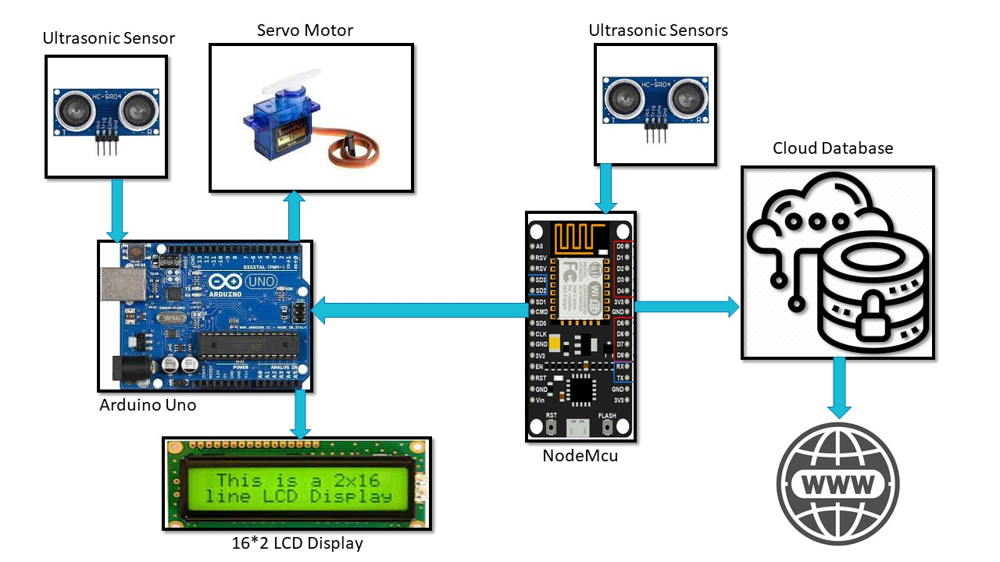
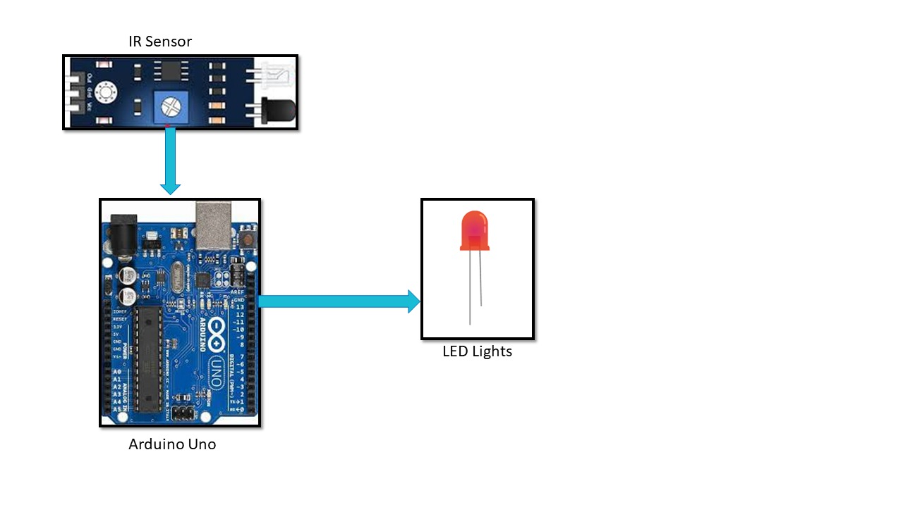
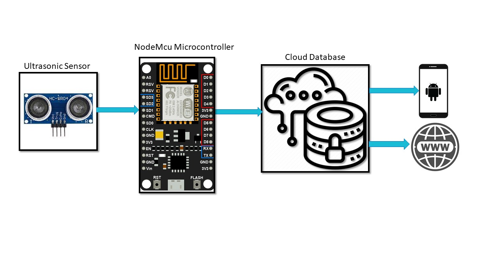
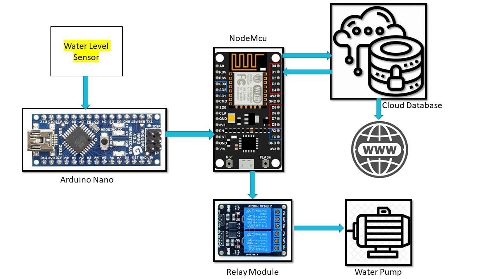

# 🌆 Smart City – IoT Based Automation System


## 📌 Project Overview

**Smart City** is an IoT-based automation project developed using:

* **Arduino**
* **NodeMCU (ESP-32)**
* **Firebase Realtime Database**
* Multiple Sensors (Ultrasonic, LDR, IR, Water Level, etc.)

The system automates essential city infrastructure such as parking, street lighting, waste monitoring, and water tank management.

---

# 🎯 Objective

To automate and intelligently manage:

* 🚗 Parking System
* 💡 Street Lighting
* 🗑 Waste Management
* 🚰 Water Tank System

The project promotes:

* Energy efficiency
* Water conservation
* Real-time monitoring
* Clean and sustainable city environment

---

# 🛠 Technologies Used

| Technology    | Purpose                     |
| ------------- | --------------------------- |
| Arduino       | Sensor interfacing          |
| ESP-32        | WiFi & IoT communication    |
| Firebase      | Cloud database              |
| Embedded C    | Microcontroller programming |
| Web Dashboard | Real-time monitoring        |

---

# 🏗 System Architecture

Sensors → Arduino → ESP-32 → Firebase → Web/Mobile Dashboard

---

# 🔹 Project Modules

---

## 🚗 1️⃣ Smart Parking System

### 📷 Block Diagram

```markdown

```


### ⚙ How It Works

* Ultrasonic sensors detect parking slot availability.
* If slot is available → Vehicle allowed entry.
* If full → Entry restricted.
* Live parking status displayed on website.
* Real-time data stored in Firebase.

### ✅ Benefits

* Reduces traffic congestion
* Saves fuel & time
* Real-time parking monitoring

---

## 💡 2️⃣ Smart Street Light System

### 📷 Block Diagram

```markdown

```


### ⚙ How It Works

* LDR detects ambient light.
* IR/Motion sensor detects movement.
* If movement detected → Light intensity increases.
* If no movement → Light remains dim.
* Reduces electricity wastage.

### ✅ Benefits

* Energy efficient
* Automated lighting
* Reduced electricity bills

---

## 🗑 3️⃣ Smart Waste Management

### 📷 Block Diagram

```markdown

```


### ⚙ How It Works

* Ultrasonic sensor detects garbage level.
* If bin is full → Notification sent via Firebase.
* Authorities can see bin status in dashboard.
* Enables faster cleaning process.

### ✅ Benefits

* Cleaner city
* Automated monitoring
* Reduced overflow issues

---

## 🚰 4️⃣ Smart Water Management System

### 📷 Block Diagram

```markdown

```


### ⚙ How It Works

* Water level sensor monitors tank level.
* If tank is empty → Pump turns ON.
* If tank is full → Pump turns OFF.
* LED indicators show water level.
* Water status visible on website.

### ✅ Benefits

* Prevents overflow
* Saves water
* Automated pump control

---

# 🌍 Social Impact

* Improved quality of life
* Cleaner environment
* Smart resource management
* Reduced manual dependency

---

# 💰 Economic Impact

* Reduced electricity consumption
* Water conservation
* Lower maintenance cost
* Sustainable urban infrastructure

---

# 🚀 Future Enhancements

* 🚦 Traffic Management System
* 🌫 Air Pollution Monitoring
* 🌾 Smart Irrigation
* 🏠 Home Automation
* 🏢 Smart Building Integration

---

# 🔧 Hardware Components

* Arduino UNO
* NodeMCU (ESP-32)
* Ultrasonic Sensors
* LDR Sensor
* IR Sensor
* Water Level Sensor
* Relay Module
* LEDs
* Water Pump

---

# 👨‍💻 Developer

GitHub: **[@786riyaz](https://github.com/786riyaz)**

Smart City – IoT College Project

---

# 📜 License

This project is developed for academic purposes and is open for learning and educational use.

---